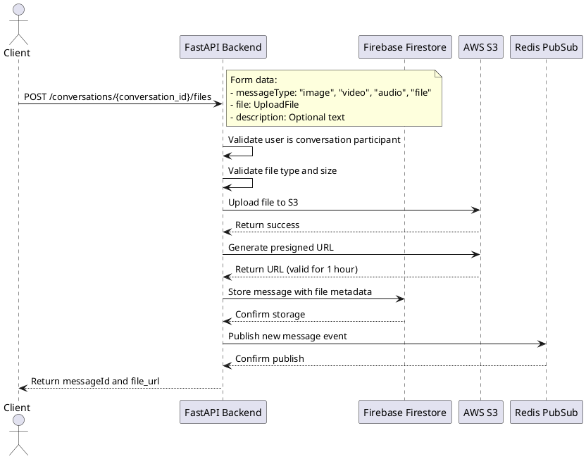
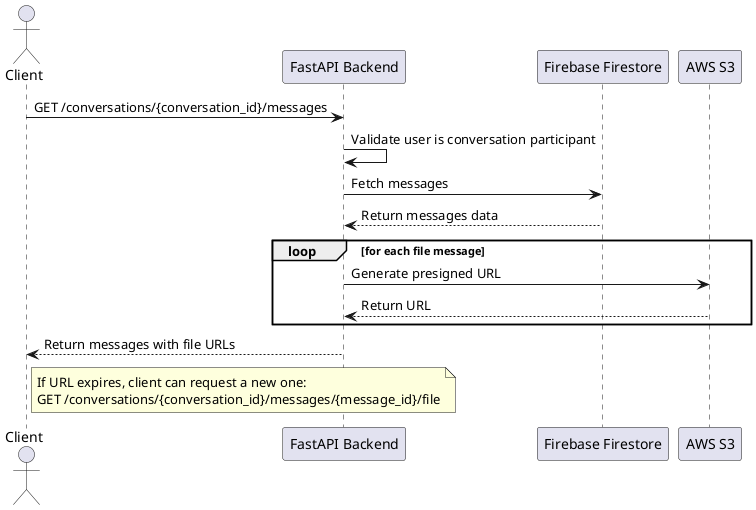

# File Upload Feature Documentation

This document provides an overview of the file upload feature for the chat application, including system flow diagrams and client-side integration examples.

## System Flow

### File Upload Flow



### File Retrieval Flow



## API Endpoints

### Upload a File

**Endpoint:** `POST /conversations/{conversation_id}/files`

**Form Parameters:**
- `messageType`: String - Type of the file message ("image", "video", "audio", "file")
- `file`: File - The file to upload
- `description`: String (Optional) - Description for the file

**Response:**
```json
{
  "messageId": "uuid-message-id",
  "file_url": "https://s3-presigned-url-to-file",
  "timestamp": "2023-04-21T14:30:45.123Z",
  "status": "sent"
}
```

### Get Messages with Files

**Endpoint:** `GET /conversations/{conversation_id}/messages`

**Query Parameters:**
- `page`: Integer - Page number for pagination
- `size`: Integer - Number of messages per page

**Response:**
```json
{
  "items": [
    {
      "messageId": "uuid-message-id",
      "senderId": "user-phone-number",
      "content": "File description or filename",
      "messageType": "image",
      "timestamp": "2023-04-21T14:30:45.123Z",
      "readBy": ["user1-phone", "user2-phone"],
      "file_info": {
        "filename": "example.jpg",
        "size": 256000,
        "mime_type": "image/jpeg",
        "s3_key": "conversations/conv-id/image/20230421143045_uuid_example.jpg"
      },
      "file_url": "https://s3-presigned-url-to-file"
    },
    // More messages...
  ],
  "total": 50,
  "page": 1,
  "size": 20
}
```

### Refresh File URL

**Endpoint:** `GET /conversations/{conversation_id}/messages/{message_id}/file`

**Response:**
```json
{
  "file_info": {
    "filename": "example.jpg",
    "size": 256000,
    "mime_type": "image/jpeg",
    "s3_key": "conversations/conv-id/image/20230421143045_uuid_example.jpg"
  },
  "file_url": "https://s3-presigned-url-to-file",
  "expires_in": 3600
}
```

## Client Integration Examples

### Web Client (JavaScript)

```javascript
// Upload a file to a conversation
async function uploadFile(conversationId, file, messageType = "image", description = "") {
  const formData = new FormData();
  formData.append("file", file);
  formData.append("messageType", messageType);
  
  if (description) {
    formData.append("description", description);
  }
  
  try {
    const response = await fetch(`/api/conversations/${conversationId}/files`, {
      method: "POST",
      headers: {
        "Authorization": `Bearer ${userToken}`
      },
      body: formData
    });
    
    if (!response.ok) {
      throw new Error(`Upload failed: ${response.statusText}`);
    }
    
    return await response.json();
  } catch (error) {
    console.error("Error uploading file:", error);
    throw error;
  }
}

// Example usage in a chat application
document.getElementById("fileInput").addEventListener("change", async (event) => {
  const file = event.target.files[0];
  if (!file) return;
  
  const conversationId = getCurrentConversationId();
  const messageType = getFileType(file.type);
  const description = document.getElementById("fileDescription").value;
  
  try {
    // Show loading indicator
    showLoadingIndicator();
    
    // Upload the file
    const result = await uploadFile(conversationId, file, messageType, description);
    
    // Handle successful upload
    addMessageToUI({
      id: result.messageId,
      type: messageType,
      content: description || file.name,
      sender: currentUser.phoneNumber,
      timestamp: result.timestamp,
      fileUrl: result.file_url
    });
    
  } catch (error) {
    showErrorMessage("Failed to upload file. Please try again.");
  } finally {
    hideLoadingIndicator();
  }
});

// Helper function to determine message type from MIME type
function getFileType(mimeType) {
  if (mimeType.startsWith("image/")) return "image";
  if (mimeType.startsWith("video/")) return "video";
  if (mimeType.startsWith("audio/")) return "audio";
  return "file";
}

// Function to refresh expired file URL
async function refreshFileUrl(conversationId, messageId) {
  try {
    const response = await fetch(`/api/conversations/${conversationId}/messages/${messageId}/file`, {
      method: "GET",
      headers: {
        "Authorization": `Bearer ${userToken}`
      }
    });
    
    if (!response.ok) {
      throw new Error(`Failed to refresh URL: ${response.statusText}`);
    }
    
    const data = await response.json();
    return data.file_url;
  } catch (error) {
    console.error("Error refreshing file URL:", error);
    throw error;
  }
}
```

### Mobile Client (Swift)

```swift
import Foundation
import UIKit

class ChatService {
    
    // Base URL for the API
    private let baseURL = "https://your-api-url.com/api"
    private let token: String
    
    init(token: String) {
        self.token = token
    }
    
    // Upload a file to a conversation
    func uploadFile(conversationId: String, file: Data, filename: String, 
                    mimeType: String, messageType: String, description: String? = nil,
                    completion: @escaping (Result<[String: Any], Error>) -> Void) {
        
        // Create URL
        let url = URL(string: "\(baseURL)/conversations/\(conversationId)/files")!
        
        // Create request
        var request = URLRequest(url: url)
        request.httpMethod = "POST"
        request.addValue("Bearer \(token)", forHTTPHeaderField: "Authorization")
        
        // Generate boundary string for multipart form
        let boundary = UUID().uuidString
        request.setValue("multipart/form-data; boundary=\(boundary)", forHTTPHeaderField: "Content-Type")
        
        // Create body
        var body = Data()
        
        // Add messageType
        body.append("--\(boundary)\r\n".data(using: .utf8)!)
        body.append("Content-Disposition: form-data; name=\"messageType\"\r\n\r\n".data(using: .utf8)!)
        body.append("\(messageType)\r\n".data(using: .utf8)!)
        
        // Add description if provided
        if let description = description {
            body.append("--\(boundary)\r\n".data(using: .utf8)!)
            body.append("Content-Disposition: form-data; name=\"description\"\r\n\r\n".data(using: .utf8)!)
            body.append("\(description)\r\n".data(using: .utf8)!)
        }
        
        // Add file
        body.append("--\(boundary)\r\n".data(using: .utf8)!)
        body.append("Content-Disposition: form-data; name=\"file\"; filename=\"\(filename)\"\r\n".data(using: .utf8)!)
        body.append("Content-Type: \(mimeType)\r\n\r\n".data(using: .utf8)!)
        body.append(file)
        body.append("\r\n".data(using: .utf8)!)
        
        // End boundary
        body.append("--\(boundary)--\r\n".data(using: .utf8)!)
        
        // Set body
        request.httpBody = body
        
        // Create task
        let task = URLSession.shared.dataTask(with: request) { data, response, error in
            if let error = error {
                completion(.failure(error))
                return
            }
            
            guard let data = data else {
                completion(.failure(NSError(domain: "No data received", code: 0, userInfo: nil)))
                return
            }
            
            do {
                if let json = try JSONSerialization.jsonObject(with: data, options: []) as? [String: Any] {
                    completion(.success(json))
                } else {
                    completion(.failure(NSError(domain: "Invalid JSON response", code: 0, userInfo: nil)))
                }
            } catch {
                completion(.failure(error))
            }
        }
        
        // Start task
        task.resume()
    }
    
    // Example usage to upload an image
    func uploadImage(conversationId: String, image: UIImage, description: String? = nil, 
                     completion: @escaping (Result<[String: Any], Error>) -> Void) {
        
        guard let imageData = image.jpegData(compressionQuality: 0.8) else {
            completion(.failure(NSError(domain: "Failed to convert image to data", code: 0, userInfo: nil)))
            return
        }
        
        uploadFile(
            conversationId: conversationId,
            file: imageData,
            filename: "image.jpg",
            mimeType: "image/jpeg",
            messageType: "image",
            description: description,
            completion: completion
        )
    }
    
    // Refresh a file URL if expired
    func refreshFileURL(conversationId: String, messageId: String, 
                        completion: @escaping (Result<String, Error>) -> Void) {
        
        let url = URL(string: "\(baseURL)/conversations/\(conversationId)/messages/\(messageId)/file")!
        
        var request = URLRequest(url: url)
        request.httpMethod = "GET"
        request.addValue("Bearer \(token)", forHTTPHeaderField: "Authorization")
        
        let task = URLSession.shared.dataTask(with: request) { data, response, error in
            if let error = error {
                completion(.failure(error))
                return
            }
            
            guard let data = data else {
                completion(.failure(NSError(domain: "No data received", code: 0, userInfo: nil)))
                return
            }
            
            do {
                if let json = try JSONSerialization.jsonObject(with: data, options: []) as? [String: Any],
                   let fileUrl = json["file_url"] as? String {
                    completion(.success(fileUrl))
                } else {
                    completion(.failure(NSError(domain: "Invalid response format", code: 0, userInfo: nil)))
                }
            } catch {
                completion(.failure(error))
            }
        }
        
        task.resume()
    }
}

// Example Usage in a View Controller
class ChatViewController: UIViewController, UIImagePickerControllerDelegate, UINavigationControllerDelegate {
    
    private let chatService = ChatService(token: "user-auth-token")
    private let conversationId = "sample-conversation-id"
    
    // Button action to pick and upload an image
    @IBAction func uploadImageButtonTapped(_ sender: Any) {
        let imagePicker = UIImagePickerController()
        imagePicker.delegate = self
        imagePicker.sourceType = .photoLibrary
        present(imagePicker, animated: true)
    }
    
    // Image picker delegate method
    func imagePickerController(_ picker: UIImagePickerController, didFinishPickingMediaWithInfo info: [UIImagePickerController.InfoKey : Any]) {
        dismiss(animated: true)
        
        guard let image = info[.originalImage] as? UIImage else {
            showAlert(message: "Failed to get image")
            return
        }
        
        // Show loading indicator
        let loadingIndicator = UIActivityIndicatorView(style: .large)
        view.addSubview(loadingIndicator)
        loadingIndicator.center = view.center
        loadingIndicator.startAnimating()
        
        // Upload image
        chatService.uploadImage(conversationId: conversationId, image: image) { [weak self] result in
            DispatchQueue.main.async {
                loadingIndicator.removeFromSuperview()
                
                switch result {
                case .success(let response):
                    if let messageId = response["messageId"] as? String,
                       let fileUrl = response["file_url"] as? String {
                        self?.addMessageToUI(messageId: messageId, fileUrl: fileUrl)
                    }
                case .failure(let error):
                    self?.showAlert(message: "Upload failed: \(error.localizedDescription)")
                }
            }
        }
    }
    
    // Helper method to add message to UI
    private func addMessageToUI(messageId: String, fileUrl: String) {
        // Implementation to update UI with the new message
        print("Added message: \(messageId) with file: \(fileUrl)")
    }
    
    // Helper method to show alerts
    private func showAlert(message: String) {
        let alert = UIAlertController(title: "Alert", message: message, preferredStyle: .alert)
        alert.addAction(UIAlertAction(title: "OK", style: .default))
        present(alert, animated: true)
    }
}
```

### Android Client (Kotlin)

```kotlin
import android.content.Context
import android.net.Uri
import android.webkit.MimeTypeMap
import okhttp3.*
import okhttp3.MediaType.Companion.toMediaTypeOrNull
import okhttp3.RequestBody.Companion.asRequestBody
import org.json.JSONObject
import java.io.File
import java.io.IOException
import java.util.*
import java.util.concurrent.TimeUnit

class ChatService(private val context: Context, private val token: String) {
    
    private val client = OkHttpClient.Builder()
        .connectTimeout(30, TimeUnit.SECONDS)
        .writeTimeout(60, TimeUnit.SECONDS)
        .readTimeout(30, TimeUnit.SECONDS)
        .build()
    
    private val baseUrl = "https://your-api-url.com/api"
    
    // Upload a file to a conversation
    fun uploadFile(
        conversationId: String,
        fileUri: Uri,
        messageType: String,
        description: String? = null,
        callback: (success: Boolean, response: JSONObject?) -> Unit
    ) {
        // Get file from URI
        val contentResolver = context.contentResolver
        val fileName = getFileName(contentResolver, fileUri) ?: "file_${System.currentTimeMillis()}"
        val mimeType = getMimeType(contentResolver, fileUri) ?: "application/octet-stream"
        
        // Create temp file
        val inputStream = contentResolver.openInputStream(fileUri)
        val tempFile = File(context.cacheDir, "temp_${UUID.randomUUID()}")
        inputStream?.use { input ->
            tempFile.outputStream().use { output ->
                input.copyTo(output)
            }
        }
        
        // Create multipart request
        val requestBody = MultipartBody.Builder()
            .setType(MultipartBody.FORM)
            .addFormDataPart("messageType", messageType)
            .addFormDataPart(
                "file",
                fileName,
                tempFile.asRequestBody(mimeType.toMediaTypeOrNull())
            )
        
        // Add description if provided
        if (description != null) {
            requestBody.addFormDataPart("description", description)
        }
        
        val request = Request.Builder()
            .url("$baseUrl/conversations/$conversationId/files")
            .header("Authorization", "Bearer $token")
            .post(requestBody.build())
            .build()
        
        client.newCall(request).enqueue(object : Callback {
            override fun onFailure(call: Call, e: IOException) {
                tempFile.delete()
                callback(false, null)
            }
            
            override fun onResponse(call: Call, response: Response) {
                tempFile.delete()
                val responseString = response.body?.string()
                
                if (response.isSuccessful && responseString != null) {
                    try {
                        val jsonResponse = JSONObject(responseString)
                        callback(true, jsonResponse)
                    } catch (e: Exception) {
                        callback(false, null)
                    }
                } else {
                    callback(false, null)
                }
            }
        })
    }
    
    // Refresh a file URL if expired
    fun refreshFileUrl(
        conversationId: String,
        messageId: String,
        callback: (success: Boolean, fileUrl: String?) -> Unit
    ) {
        val request = Request.Builder()
            .url("$baseUrl/conversations/$conversationId/messages/$messageId/file")
            .header("Authorization", "Bearer $token")
            .get()
            .build()
        
        client.newCall(request).enqueue(object : Callback {
            override fun onFailure(call: Call, e: IOException) {
                callback(false, null)
            }
            
            override fun onResponse(call: Call, response: Response) {
                val responseString = response.body?.string()
                
                if (response.isSuccessful && responseString != null) {
                    try {
                        val jsonResponse = JSONObject(responseString)
                        val fileUrl = jsonResponse.getString("file_url")
                        callback(true, fileUrl)
                    } catch (e: Exception) {
                        callback(false, null)
                    }
                } else {
                    callback(false, null)
                }
            }
        })
    }
    
    // Helper method to get file name from URI
    private fun getFileName(contentResolver: ContentResolver, uri: Uri): String? {
        var result: String? = null
        if (uri.scheme == "content") {
            val cursor = contentResolver.query(uri, null, null, null, null)
            cursor?.use {
                if (it.moveToFirst()) {
                    val nameIndex = it.getColumnIndex(android.provider.OpenableColumns.DISPLAY_NAME)
                    if (nameIndex != -1) {
                        result = it.getString(nameIndex)
                    }
                }
            }
        }
        if (result == null) {
            result = uri.path
            val cut = result?.lastIndexOf('/')
            if (cut != -1) {
                result = result?.substring(cut!! + 1)
            }
        }
        return result
    }
    
    // Helper method to get MIME type from URI
    private fun getMimeType(contentResolver: ContentResolver, uri: Uri): String? {
        return contentResolver.getType(uri) ?: run {
            val fileExtension = MimeTypeMap.getFileExtensionFromUrl(uri.toString())
            MimeTypeMap.getSingleton().getMimeTypeFromExtension(fileExtension.toLowerCase())
        }
    }
}

// Example usage in an Activity
class ChatActivity : AppCompatActivity() {
    
    private lateinit var chatService: ChatService
    private val conversationId = "sample-conversation-id"
    
    override fun onCreate(savedInstanceState: Bundle?) {
        super.onCreate(savedInstanceState)
        setContentView(R.layout.activity_chat)
        
        chatService = ChatService(this, "user-auth-token")
        
        // Set up upload button click listener
        findViewById<Button>(R.id.uploadButton).setOnClickListener {
            openFilePicker()
        }
    }
    
    private fun openFilePicker() {
        val intent = Intent(Intent.ACTION_GET_CONTENT)
        intent.type = "*/*"
        startActivityForResult(intent, FILE_PICK_REQUEST)
    }
    
    override fun onActivityResult(requestCode: Int, resultCode: Int, data: Intent?) {
        super.onActivityResult(requestCode, resultCode, data)
        
        if (requestCode == FILE_PICK_REQUEST && resultCode == RESULT_OK) {
            val fileUri = data?.data ?: return
            
            // Show loading indicator
            val progressDialog = ProgressDialog(this)
            progressDialog.setMessage("Uploading file...")
            progressDialog.setCancelable(false)
            progressDialog.show()
            
            // Determine message type from file
            val messageType = determineMessageType(fileUri)
            
            // Upload the file
            chatService.uploadFile(conversationId, fileUri, messageType) { success, response ->
                runOnUiThread {
                    progressDialog.dismiss()
                    
                    if (success && response != null) {
                        val messageId = response.optString("messageId")
                        val fileUrl = response.optString("file_url")
                        
                        // Add message to UI
                        addMessageToUI(messageId, fileUrl)
                        Toast.makeText(this, "File uploaded successfully", Toast.LENGTH_SHORT).show()
                    } else {
                        Toast.makeText(this, "Failed to upload file", Toast.LENGTH_SHORT).show()
                    }
                }
            }
        }
    }
    
    private fun determineMessageType(uri: Uri): String {
        val mimeType = contentResolver.getType(uri) ?: "application/octet-stream"
        
        return when {
            mimeType.startsWith("image/") -> "image"
            mimeType.startsWith("video/") -> "video"
            mimeType.startsWith("audio/") -> "audio"
            else -> "file"
        }
    }
    
    private fun addMessageToUI(messageId: String, fileUrl: String) {
        // Implementation to update UI with the new message
        println("Added message: $messageId with file: $fileUrl")
    }
    
    companion object {
        private const val FILE_PICK_REQUEST = 1001
    }
}
```

## Testing Tips

1. **Upload Different File Types**:
   - Test with images, videos, audio files, and other document types
   - Verify that each type is handled correctly

2. **File Size Limits**:
   - Test with files close to the size limit (100MB by default)
   - Verify that files exceeding the limit are rejected

3. **URL Expiration**:
   - Test accessing a file after the presigned URL has expired
   - Verify that the refresh endpoint works correctly

4. **Authorization**:
   - Verify that only conversation participants can upload files
   - Verify that only conversation participants can access files

## Troubleshooting

1. **S3 Access Issues**:
   - Check AWS credentials are correctly configured in environment variables
   - Verify bucket permissions allow the application to read/write files

2. **File Type Errors**:
   - Ensure file MIME type is among allowed types in configuration
   - Check content-type is being correctly detected by client

3. **URL Expiration**:
   - If files become inaccessible, use the refresh endpoint to get a new URL
   - Check S3 presigned URL expiration setting in AWS configuration