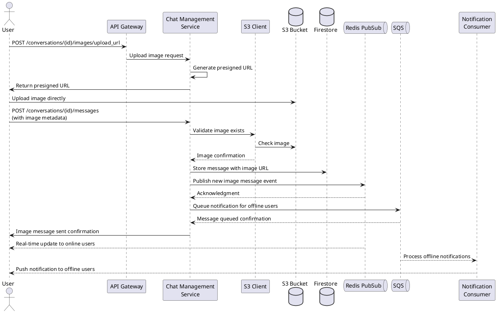

# Image Message Handling for Chat Management Service

## Overview
This document outlines the implementation of image message handling in the chat_management service. Image messages require a special workflow involving uploads to Amazon S3 and storing references in Firestore.

## Architecture

### Message Flow
The image message flow follows a two-step process:
1. **Upload Process**: The client requests a presigned URL and uploads directly to S3
2. **Message Creation**: The client sends a message referencing the uploaded image

### Components
- **S3 Client**: Handles interaction with Amazon S3 for storing images
- **Image Upload Endpoint**: Provides presigned URLs for direct uploads
- **Message Endpoint**: Enhanced to handle image messages with metadata

## Flow Diagram



## API Endpoints

### Get Image Upload URL
```
POST /conversations/{conversation_id}/images/upload_url
```

**Request Body:**
```json
{
  "content_type": "image/jpeg",
  "filename": "example.jpg"  // Optional
}
```

**Response:**
```json
{
  "upload_url": "https://s3-presigned-url...",
  "object_key": "images/user123/20240419-123456-uuid.jpg",
  "file_url": "https://bucket-name.s3.region.amazonaws.com/images/user123/20240419-123456-uuid.jpg",
  "expires_at": "2024-04-19T12:44:56.789Z"
}
```

### Send Image Message
```
POST /conversations/{conversation_id}/messages
```

**Request Body:**
```json
{
  "content": "Check out this photo!",  // Optional caption
  "messageType": "image",
  "metadata": {
    "object_key": "images/user123/20240419-123456-uuid.jpg",
    "url": "https://bucket-name.s3.region.amazonaws.com/images/user123/20240419-123456-uuid.jpg",
    "width": 800,           // Optional
    "height": 600,          // Optional
    "content_type": "image/jpeg",
    "size_bytes": 102400    // Optional
  }
}
```

## Message Data Structure

Image messages are stored in Firestore with the following structure:

```json
{
  "messageId": "uuid-string",
  "content": "Optional caption text",
  "messageType": "image",
  "senderId": "user123",
  "timestamp": "2024-04-19T12:35:00Z",
  "readBy": ["user123"],
  "metadata": {
    "object_key": "images/user123/20240419-123456-uuid.jpg",
    "url": "https://bucket-name.s3.region.amazonaws.com/images/user123/20240419-123456-uuid.jpg",
    "width": 800,
    "height": 600,
    "content_type": "image/jpeg",
    "size_bytes": 102400
  }
}
```

## Client Implementation Guide

### Image Upload Process
1. **Request Upload URL**:
   ```javascript
   const response = await api.post(
     `/conversations/${conversationId}/images/upload_url`,
     { content_type: file.type }
   );
   const { upload_url, object_key, file_url } = response.data;
   ```

2. **Upload Image to S3**:
   ```javascript
   await fetch(upload_url, {
     method: 'PUT',
     body: file,
     headers: {
       'Content-Type': file.type
     }
   });
   ```

3. **Send Image Message**:
   ```javascript
   await api.post(`/conversations/${conversationId}/messages`, {
     content: caption,  // Optional caption
     messageType: 'image',
     metadata: {
       object_key,
       url: file_url,
       content_type: file.type,
       // Add other metadata as needed
     }
   });
   ```

### Displaying Images
1. Use the `url` from the message metadata to display the image
   - The URL format will be: `https://images.zalo-phake.example.com/{conversation_id}/{object_key}`
   - The server will authenticate the user before serving the image
2. Handle potential loading states and errors (401/403 for unauthorized access)
3. Show the caption if provided in the content field
4. Authorization is handled automatically if the user is authenticated with the app

## Security Considerations

1. **Access Control**:
   - Only authenticated users who are participants in a conversation can request upload URLs
   - Upload URLs expire after a set time (default: 1 hour)
   - Images are stored in conversation-specific paths to organize access
   - A secure proxy endpoint ensures only conversation participants can view images

2. **Content Validation**:
   - Content type validation ensures only images are uploaded
   - The server verifies the image exists in S3 before creating a message
   - Image metadata includes the conversation and uploader IDs for access control

3. **S3 Configuration**:
   - The S3 bucket should have appropriate CORS settings to allow uploads from client applications
   - Bucket policies should prevent public access entirely
   - Direct URLs to S3 are never exposed to clients

4. **Image Access Proxy**:
   - A dedicated `/images/{conversation_id}/{object_key}` endpoint controls access
   - Server-side authorization verifies the user is a conversation participant
   - Temporary signed URLs are generated only for authorized users
   - All image access is logged for audit purposes

## Error Handling

1. **Upload URL Generation Errors**:
   - Network errors: Retry with exponential backoff
   - Authentication errors: Redirect to login
   - Permission errors: Show appropriate error message

2. **Upload Errors**:
   - Network interruptions: Implement retry mechanism
   - Expired URL: Request a new upload URL and retry

3. **Message Creation Errors**:
   - Image not found: Restart the upload process
   - Server errors: Implement retry logic

## Deployment Requirements

1. **S3 Configuration**:
   ```
   aws s3api create-bucket \
     --bucket zalo-phake-images \
     --region ap-southeast-1
   ```

2. **CORS Configuration**:
   ```json
   {
     "CORSRules": [
       {
         "AllowedOrigins": ["*"],
         "AllowedHeaders": ["*"],
         "AllowedMethods": ["GET", "PUT", "POST", "HEAD"],
         "MaxAgeSeconds": 3000
       }
     ]
   }
   ```
   
3. **Environment Variables**:
   ```
   # AWS Configuration
   AWS_ACCESS_KEY_ID=your_access_key
   AWS_SECRET_ACCESS_KEY=your_secret_key
   AWS_REGION=ap-southeast-1
   S3_BUCKET_NAME=zalo-phake-images
   ```

4. **IAM Permissions**:
   The service needs the following permissions:
   - `s3:PutObject`
   - `s3:GetObject`
   - `s3:HeadObject`
   - `s3:DeleteObject`

## Testing

### Manual Testing

1. **Upload URL Generation**:
   ```shell
   curl -X POST \
     "http://localhost:8000/conversations/123/images/upload_url" \
     -H "Authorization: Bearer <token>" \
     -H "Content-Type: application/json" \
     -d '{"content_type": "image/jpeg"}'
   ```

2. **Direct S3 Upload** (using the URL from the previous response):
   ```shell
   curl -X PUT \
     "<presigned_url>" \
     -H "Content-Type: image/jpeg" \
     --data-binary "@/path/to/image.jpg"
   ```

3. **Send Image Message**:
   ```shell
   curl -X POST \
     "http://localhost:8000/conversations/123/messages" \
     -H "Authorization: Bearer <token>" \
     -H "Content-Type: application/json" \
     -d '{
       "content": "Check out this photo!",
       "messageType": "image",
       "metadata": {
         "object_key": "<object_key_from_upload_response>",
         "url": "<file_url_from_upload_response>",
         "content_type": "image/jpeg"
       }
     }'
   ```

## Implementation Checklist

- [x] Add S3 configuration to AWS settings
- [x] Implement S3 client for image operations
- [x] Create new schema models for image uploads
- [x] Add image upload URL endpoint
- [x] Enhance message creation endpoint for image support
- [x] Document the image message flow
- [ ] Add unit tests for image handling
- [ ] Set up S3 bucket and permissions in production
- [ ] Update client applications to support image uploads

## Monitoring and Maintenance

1. **Metrics to Track**:
   - Image upload success/failure rates
   - Upload latency
   - S3 storage usage
   - Average image size

2. **Potential Issues**:
   - S3 cost management for high-volume usage
   - Large images impacting client performance
   - Storage cleanup for deleted conversations

3. **Maintenance Tasks**:
   - Periodically clean up orphaned images (not referenced by any messages)
   - Monitor S3 costs and implement optimization if needed
   - Consider implementing image compression for large files
