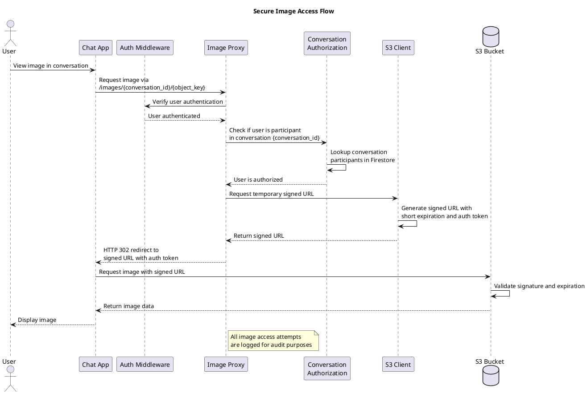

# Image Security in Chat Management

## Overview
This document outlines the security measures implemented to ensure that only authorized users can access images in conversations.

## Security Architecture

The image security implementation follows these key principles:

1. **Zero Public Access**: Images are never directly accessible to the public
2. **Conversation-Based Authorization**: Only participants in a conversation can access its images
3. **Defense in Depth**: Multiple layers of security controls protect every image
4. **Secure by Default**: All image URLs require authentication and authorization

## Security Flow



## Security Layers

### 1. Storage Security
- Images are stored in S3 with a hierarchical path structure: `conversations/{conversation_id}/images/{user_id}/{filename}`
- This organization allows for:
  - Easy permission management by conversation
  - Efficient cleanup when conversations are deleted
  - Clear audit trail connecting images to users and conversations
- Bucket policies prevent direct public access

### 2. Access Control
- **Authentication**: All image requests require a valid user authentication token
- **Authorization**: Server verifies that the requesting user is a participant in the conversation
- **Time-Limited Access**: Signed URLs expire quickly (default: 1 hour)
- **Contextual Validation**: Object key paths are validated against the requested conversation

### 3. Image Proxy Service
- A dedicated endpoint `/images/{conversation_id}/{object_key}` handles all image access
- The proxy:
  1. Verifies user authentication
  2. Checks if the user is a conversation participant
  3. Verifies the image exists and belongs to the requested conversation
  4. Generates a temporary signed URL with embedded authentication tokens
  5. Logs the access for audit purposes
  6. Redirects the user to the secured temporary URL

### 4. URL Security
- Direct S3 URLs are never exposed to clients
- All image URLs in messages point to the secure proxy
- URL format: `https://images.example.com/{conversation_id}/{object_key}`
- The proxy implementation handles:
  - Authorization verification
  - Rate limiting
  - Access logging
  - Path validation

## Security Controls

| Security Control | Implementation |
|------------------|----------------|
| Authentication | JWT-based user authentication required for all image access |
| Authorization | Server-side verification of conversation membership |
| Access Audit | All image access attempts are logged with user ID, conversation ID, and timestamp |
| Input Validation | Object keys and conversation IDs are validated against expected formats |
| Temporary Access | Signed URLs expire after a short period (1 hour by default) |
| Metadata Verification | Image metadata is checked to ensure it belongs to the requested conversation |
| Path Isolation | Images are organized in conversation-specific paths for natural access control |

## Configuration

### Environment Variables
```
# Image security settings
IMAGE_PROXY_URL=https://images.zalo-phake.example.com
IMAGE_AUTH_SECRET=<strong-random-secret>
IMAGE_URL_EXPIRATION=3600
```

### AWS S3 Bucket Policy
```json
{
  "Version": "2012-10-17",
  "Statement": [
    {
      "Sid": "DenyPublicAccess",
      "Effect": "Deny",
      "Principal": "*",
      "Action": "s3:GetObject",
      "Resource": "arn:aws:s3:::zalo-phake-images/*",
      "Condition": {
        "StringNotLike": {
          "aws:Referer": [
            "https://images.zalo-phake.example.com/*"
          ]
        }
      }
    },
    {
      "Sid": "AllowServiceAccess",
      "Effect": "Allow",
      "Principal": {
        "AWS": "arn:aws:iam::ACCOUNT_ID:role/zalo-phake-service-role"
      },
      "Action": [
        "s3:PutObject",
        "s3:GetObject",
        "s3:HeadObject",
        "s3:DeleteObject"
      ],
      "Resource": "arn:aws:s3:::zalo-phake-images/*"
    }
  ]
}
```

## Client Implementation Guidelines

### Displaying Images Securely

Clients should follow these guidelines to ensure secure image handling:

1. **Never use direct S3 URLs**: Even if metadata contains a direct S3 URL, always use the proxy URL format:
   ```
   https://images.zalo-phake.example.com/{conversation_id}/{object_key}
   ```

2. **Handle unauthorized errors**: If a 401 or 403 error occurs, show an appropriate message like "You don't have permission to view this image" rather than a generic error.

3. **Never cache URLs externally**: The authorization to view an image may be revoked (e.g., if a user is removed from a conversation).

4. **Include auth tokens**: Ensure your HTTP client includes authentication tokens when requesting images.

5. **Example Implementation**:

```javascript
function getSecureImageUrl(message) {
  if (message.messageType !== 'image' || !message.metadata) {
    return null;
  }
  
  const baseUrl = 'https://images.zalo-phake.example.com';
  const conversationId = message.metadata.conversation_id || extractConversationId(message);
  const objectKey = message.metadata.object_key;
  
  if (!conversationId || !objectKey) {
    return null;
  }
  
  // Encode the object key properly for URLs
  const encodedKey = encodeURIComponent(objectKey);
  return `${baseUrl}/${conversationId}/${encodedKey}`;
}

function extractConversationId(message) {
  // Try to extract conversation ID from object key if available
  const objectKey = message.metadata.object_key;
  if (objectKey && objectKey.startsWith('conversations/')) {
    // Format: conversations/{conv_id}/images/{user_id}/{filename}
    const parts = objectKey.split('/');
    if (parts.length >= 2) {
      return parts[1];
    }
  }
  return null;
}
```

## Potential Attack Vectors and Mitigations

| Attack Vector | Mitigation |
|---------------|------------|
| URL guessing | Object keys contain UUIDs; authorization check prevents unauthorized access |
| URL sharing | URLs require authentication and authorization for each request |
| Participant removal | Image access is checked on each request, not cached long-term |
| Metadata tampering | Server validates that the image exists and belongs to the claimed conversation |
| Path traversal | Object key validation prevents path traversal attacks |

## Maintenance and Monitoring

### Access Logs

All image access attempts are logged with:
- User ID
- Conversation ID
- Object key
- Timestamp
- Success/failure status
- Source IP address

### Suspicious Activity Detection

Consider monitoring for:
- Multiple failed access attempts
- Access attempts to conversations the user doesn't belong to
- Unusual access patterns (rate, time of day, etc.)

### Cleanup Procedures

1. **Conversation Deletion**: When a conversation is deleted, schedule a task to remove all images in the corresponding S3 path.

2. **User Removal**: When a user is removed from a conversation, their access to images is immediately revoked due to authorization checks.

3. **Stale Images**: Consider a periodic job to identify and remove orphaned images that are no longer referenced by any messages.

## Conclusion

This multi-layered security approach ensures that images shared in conversations remain private and accessible only to authorized participants. The design balances security with performance by using temporary signed URLs while maintaining strict access controls through a dedicated proxy service.
